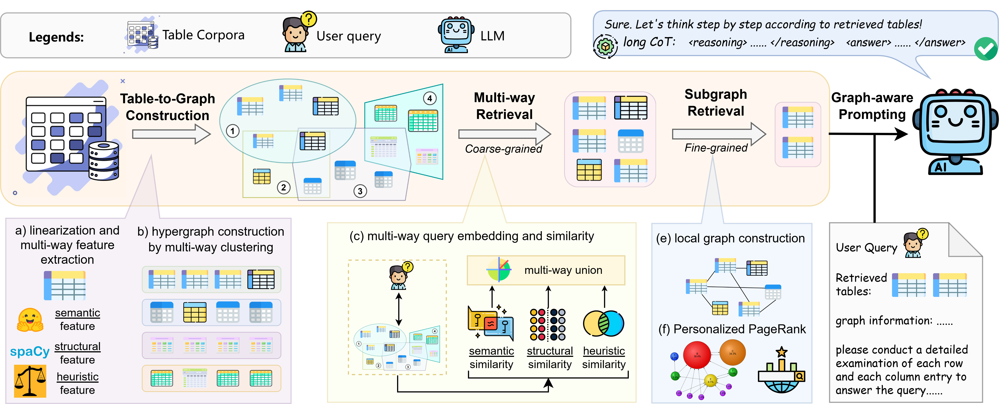

<div align="center">
<br>

<h3>Hierarchical Memory Index, Multi-Stage Retrieval, and Benchmarking</h3>
</div>

<p align="center">
  <a href="https://arxiv.org/abs/2504.01346"></a>
  <a href="https://huggingface.co/collections/jiaruz2/multitableqa-68dc8d850ea7e168f47cecd8"></a>
  <a href="https://opensource.org/licenses/MIT"></a>
</p>



**Official implementation of the paper:**  
📄 *RAG over Tables: Hierarchical Memory Index, Multi-Stage Retrieval, and Benchmarking*


## 🔍 Introduction

Retrieval-Augmented Generation (RAG) has become a key paradigm to enhance Large Language Models (LLMs) with external knowledge. While most RAG systems focus on **text corpora**, real-world information is often stored in **tables** across web pages, Wikipedia, and relational databases. Existing methods struggle to retrieve and reason across **multiple heterogeneous tables**.

This repository provides the implementation of **T-RAG**, a novel table-corpora-aware RAG framework featuring:

- **Hierarchical Memory Index** – organizes heterogeneous table knowledge at multiple granularities.  
- **Multi-Stage Retrieval** – coarse-to-fine retrieval combining clustering, subgraph reasoning, and PageRank.  
- **Graph-Aware Prompting** – injects relational priors into LLMs for structured tabular reasoning.  
- **MultiTableQA Benchmark** – a large-scale dataset with **57,193 tables** and **23,758 questions** across various tabular tasks.


## 🚀 Installation

```bash
git clone https://github.com/jiaruzouu/T-RAG.git
cd T-RAG

conda create -n trag python=3.11.9
conda activate trag

# Install dependencies
pip install -r requirements.txt
```

## ✨ Usage

### 1. MultiTableQA Data Preparation

For MultiTableQA, we release a comprehensive benchmark via [Hugging Face](https://huggingface.co/collections/jiaruz2/multitableqa-68dc8d850ea7e168f47cecd8), constructed from five widely used table QA datasets: TATQA, TabFact, SQA, WTQ, and HybridQA. MultiTableQA extends the traditional single-table QA setting into a **multi-table retrieval and question answering benchmark**, enabling more realistic and challenging evaluations.

Our benchmark including five different datasets covering table fact-checking, single-hop QA, and multi-hop QA: 
| Dataset              | Link |
|-----------------------|------|
| MultiTableQA-TATQA    | 🤗 [dataset link](https://huggingface.co/datasets/jiaruz2/MultiTableQA_TATQA)   |
| MultiTableQA-TabFact  | 🤗 [dataset link](https://huggingface.co/datasets/jiaruz2/MultiTableQA_TabFact) |
| MultiTableQA-SQA      | 🤗 [dataset link](https://huggingface.co/datasets/jiaruz2/MultiTableQA_SQA)     |
| MultiTableQA-WTQ      | 🤗 [dataset link](https://huggingface.co/datasets/jiaruz2/MultiTableQA_WTQ)     |
| MultiTableQA-HybridQA | 🤗 [dataset link](https://huggingface.co/datasets/jiaruz2/MultiTableQA_HybridQA)|


To download and preprocess the **MultiTableQA** benchmark:

```bash
cd table2graph
bash scripts/prepare_data.sh
```

This script will automatically fetch the source tables, apply decomposition (row/column splitting), and generate the benchmark splits.

### 2. Run T-RAG Retrieval

To run hierarchical index construction and multi-stage retrieval:

**Stage 1 & 2: Table to Graph Construction & Coarse-grained Multi-way Retrieval**

Stages 1 & 2 include:
- Table Linearization
- Multi-way Feature Extraction
- Hypergraph Construction by Multi-way Clustering
- Typical Node Selection for Efficient Table Retrieval
- Query-Cluster Assignment

To run this,

```bash
cd src
cd table2graph
bash scripts/table_cluster_run.sh #  or python scripts/table_cluster_run.py
```

**Stage 3: Fine-grained sub-graph Retrieval**
Stage 3 includes:
- Local Subgraph Construction
- Iterative Personalized PageRank for Retrieval.

To run this,
```bash
cd src
cd table2graph
python scripts/subgraph_retrieve_run.py
```

*Note: Our method supports different embedding methods such as E5, contriever, sentence-transformer, etc.**

### 3. Downstream Inference with LLMs
Evaluate T-RAG with an (open/closed-source) LLM of your choice (e.g., GPT-4o, Claude-3.5, Qwen):

For Closed-source LLM, please first insert your key under `key.json`
```json
{
    "openai": "<YOUR_OPENAI_API_KEY>",
    "claude": "<YOUR_CLAUDE_API_KEY>"
}
```

To run end-to-end model inference and evaluation,

```bash
cd src
cd downstream_inference
bash scripts/overall_run.sh
```


## 📖 Citation

If you find our work useful, please cite:

```bibtex
@misc{zou2025rag,
      title={RAG over Tables: Hierarchical Memory Index, Multi-Stage Retrieval, and Benchmarking}, 
      author={Jiaru Zou and Dongqi Fu and Sirui Chen and Xinrui He and Zihao Li and Yada Zhu and Jiawei Han and Jingrui He},
      year={2025},
      eprint={2504.01346},
      archivePrefix={arXiv},
      primaryClass={cs.CL},
      url={https://arxiv.org/abs/2504.01346}, 
}
```

